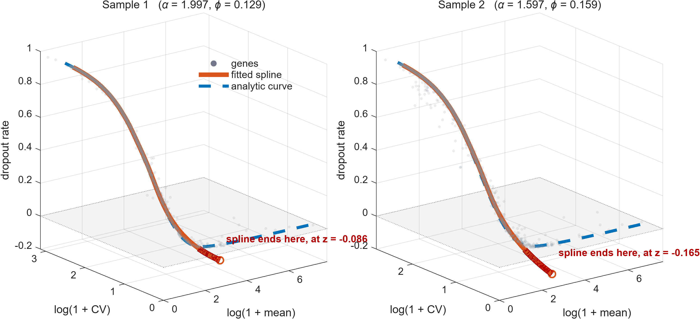
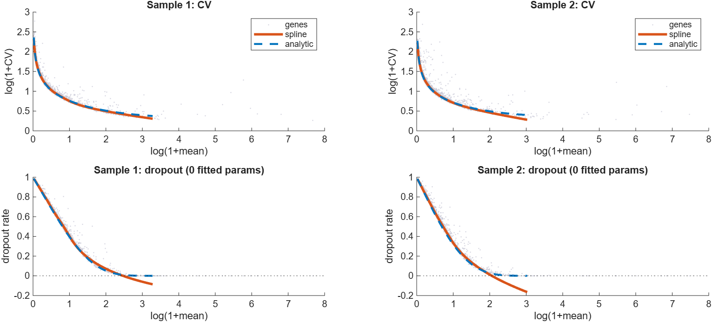

# An analytic form for the Spline-DV 3-D curve

The spline-DV method places every gene at
$(x,y,z) = (\log(1+\mu),\ \log(1+C_\sigma),\ D_r)$ — log mean, log CV, dropout
rate — and fits a smoothing spline through the resulting point cloud
(`sc_splinefit`: 15 pieces, robustness 0.75, arclength parameterization).
Deviation from that curve is the per-condition statistic; the difference of the
two deviation vectors is the DV score.

The curve does not have to be estimated nonparametrically. Under the standard
count model for droplet scRNA-seq it has a closed form with **one** fitted
parameter, and its dropout coordinate has a closed form with **none**.

## 1. Setup

Let $K_{ij}$ be the raw count of gene $i$ in cell $j$, $L_j=\sum_i K_{ij}$ the
library size, $n$ the number of cells, and $c$ the normalization scale
(`pkg.norm_libsize` uses $c=10^4$, i.e. CP10K). The pipeline analyses

$$X_{ij} = c\,K_{ij}/L_j .$$

Model the counts as gamma-Poisson (negative binomial) with cell-independent
gene rate $\lambda_i$ (an expression *fraction*) and dispersion $\phi$:

$$\mathbb{E}[K_{ij}] = L_j\lambda_i,\qquad
\operatorname{Var}(K_{ij}) = L_j\lambda_i + \phi (L_j\lambda_i)^2 .$$

$\phi\to 0$ is the pure-Poisson (technical-noise-only) limit.

## 2. The three coordinates

**Mean.** $\mathbb{E}[X_{ij}] = c\lambda_i$ for every cell, so

$$\mu_i = c\lambda_i .$$

Library-size normalization has removed the cell-to-cell mean variation — this
is what makes the rest of the derivation clean.

**CV.** Because every cell has the same mean, the pooled variance is the
average of the per-cell variances:

$$\operatorname{Var}(X_{i\cdot})
= \frac1n\sum_j \frac{c^2}{L_j^2}\big(L_j\lambda_i + \phi L_j^2\lambda_i^2\big)
= c^2\lambda_i \overline{\left(\tfrac1L\right)} + \phi\,c^2\lambda_i^2 ,$$

hence

$$\boxed{\;C_{\sigma}^2(\mu) = \frac{\alpha}{\mu} + \phi,
\qquad \alpha \equiv c\,\overline{\left(\tfrac1L\right)} = \frac{c}{n}\sum_j \frac{1}{L_j}\;}$$

$\alpha$ is **not** fitted: it is $c$ divided by the harmonic mean of the
library sizes. On the bundled GSM3308547/8 data, $\alpha = 1.997$ and $1.597$.

**Dropout.** Zeros are invariant to a positive per-cell rescaling, so
$D_r$ can be computed on raw counts. For the gamma-Poisson,
$\Pr(K_{ij}=0) = (1+\phi L_j\lambda_i)^{-1/\phi}$, so

$$\boxed{\;D_r(\mu) = \frac1n\sum_j\Big(1 + \phi_z\,\frac{L_j\mu}{c}\Big)^{-1/\phi_z}
\;\xrightarrow[\ \phi_z\to0\ ]{}\;
\frac1n\sum_j e^{-L_j\mu/c}\;}$$

The Poisson limit is exactly the **empirical Laplace transform of the library
sizes**, evaluated at the gene's rate $\lambda=\mu/c$. It contains no free
parameter at all — it is a deterministic function of the cell library sizes,
which are already known.

## 3. The curve

Parameterized by $\mu>0$:

$$\mathbf{r}(\mu) = \Big(\ \log(1+\mu),\ \
\log\!\big(1+\sqrt{\alpha/\mu+\phi}\big),\ \
\tfrac1n\textstyle\sum_j (1+\phi_z L_j\mu/c)^{-1/\phi_z}\ \Big)$$

with $\alpha$ given in closed form, $\phi$ the single fitted overdispersion,
and $\phi_z=0$ (Poisson dropout) working best in practice — see §5.

**Implicit form.** The mean–CV relation is the cylinder

$$(e^{y}-1)^2\,(e^{x}-1) = \alpha + \phi\,(e^x-1),$$

and in the idealized case of equal library sizes ($L_j\equiv L$, $\phi=0$,
$\alpha=c/L$) the dropout coordinate collapses to a relation in $y$ alone,
free of every parameter:

$$z = \exp\!\big(-(e^{x}-1)/\alpha\big) = \exp\!\Big(-\big(e^{y}-1\big)^{-2}\Big).$$

So the "3-D curve" is, structurally, the intersection of two surfaces; only
library-size heterogeneity and biological overdispersion perturb it.

**Inputs and outputs.** This is a parametric space curve, not a surface: one
independent variable, three dependent ones.

| | |
|---|---|
| independent variable | $\mu>0$, the gene's normalized mean (equivalently $\lambda=\mu/c$) |
| dependent variables | $x(\mu),y(\mu),z(\mu)$ — log mean, log CV, dropout rate |

To instantiate the curve you need the raw library sizes $\{L_j\}$, the scale
$c$, and the two dispersions. Of those, $\alpha$ is a closed form of $\{L_j\}$,
$\phi_z$ is fixed at 0, and **$\phi$ is the only fitted quantity** — the whole
reference curve costs one scalar, and its dropout coordinate costs none.

Per gene, projecting $\mathbf p_i=(x_i,y_i,z_i)$ onto the curve returns
$\hat\mu_i$ (the fitted rate, an interpretable by-product), the foot point
$\mathbf r(\hat\mu_i)$, the deviation $\vec v_i=\mathbf p_i-\mathbf r(\hat\mu_i)$
with $d_i=\|\vec v_i\|$, and hence the DV score
$\|\vec v_i^{(2)}-\vec v_i^{(1)}\|$.

Note the contrast: with a spline, all 9,654 genes are collectively inputs to
the reference curve, so it depends on the sample in an uncontrolled way. Here
the genes enter the reference only through $\phi$.

**Derivatives** (for exact Newton projection, no discretization):

$$x'=\frac{1}{1+\mu},\qquad
y'=\frac{w'}{1+w}\ \ \text{with}\ \ w=\sqrt{\alpha/\mu+\phi},\ w'=-\frac{\alpha}{2\mu^2 w},$$
$$z'=-\frac1n\sum_j \frac{L_j}{c}\Big(1+\phi_z\frac{L_j\mu}{c}\Big)^{-1/\phi_z-1}
\ \xrightarrow[\phi_z\to0]{}\ -\frac1n\sum_j \frac{L_j}{c}e^{-L_j\mu/c}.$$

The foot point of a gene $\mathbf{p}$ solves
$\big(\mathbf{r}(\mu)-\mathbf{p}\big)\cdot\mathbf{r}'(\mu)=0$.

## 4. Estimating $\phi$

$\phi$ can be fitted with a one-dimensional robust regression directly on the
gene cloud — no spline needed anywhere:

$$\hat\phi = \arg\min_\phi \sum_i \big|\log(1+\sqrt{\alpha/\mu_i+\phi}) - \log(1+C_{\sigma,i})\big| .$$

L1 keeps genuinely variable genes from dragging the reference upward, playing
the role the spline's robustness weight (0.75) plays now.

## 5. How well it reproduces the spline

Bundled data (`MATLAB/GSM3308547_GSM3308548.mat`), QC-filtered, gene sets
intersected: 9,654 genes; 994 and 875 cells.

| | sample 1 | sample 2 |
|---|---|---|
| $\alpha$ (closed form) | 1.9973 | 1.5970 |
| $\hat\phi$ (L1 on genes / fitted to spline) | 0.152 / 0.129 | 0.200 / 0.159 |
| $\log(1+C_\sigma)$: RMSE vs. spline (range ≈ 0.3–2.3) | 0.0110 | 0.0132 |
| $\log(1+C_\sigma)$: $R^2$ vs. spline | 0.99934 | 0.99896 |
| $D_r$, Poisson, **0 fitted parameters**: RMSE vs. spline | 0.0071 | 0.0116 |
| $D_r$, Poisson: $R^2$ vs. spline | 0.99868 | 0.99688 |
| $D_r$, Poisson: $R^2$ vs. the 9,654 **genes** | 0.9944 | 0.9915 |

Downstream, replacing the spline with the analytic curve throughout the
`test.m` DV pipeline gives Spearman $\rho = 0.93$ with the spline DV score,
73/100 top-100 overlap and 388/500 top-500 overlap. Runtime is 2–3 s per
sample.



*The gene cloud in the 3-D space the method works in, with the fitted spline
(solid) and the analytic curve (dashed). The shaded surface is $z=0$. The two
curves are indistinguishable over the body of the data; the spline then stops
where the genes thin out, having already left the feasible region, while the
analytic curve stays on the plane and continues across the full range of gene
means.*



*The same comparison coordinate by coordinate, which makes the size of the
discrepancy readable.*

## 6. Why the analytic curve is preferable where the two disagree

* **The spline leaves the feasible region.** Its dropout coordinate reaches
  $-0.086$ (sample 1) and $-0.165$ (sample 2) — a negative rate. The largest
  analytic-vs-spline discrepancies are exactly there. The analytic curve is
  a mixture of survival functions, so $0<z\le1$ by construction, and $y$ is
  monotone decreasing as it must be.
* **The curve is defined for all $\mu>0$.** The spline only spans the
  arclength of the observed genes, which is why `sc_splinefit` rescales the
  distance by 1/100 and 1/10 for genes past either end, and why `test.m`
  zeroes out genes whose `nearidx` is the first or last knot. Those patches
  are unnecessary with a closed form. (On these data the spline stops near
  $\log(1+\mu)=3.3$ while genes extend to 7.7.)
* **No hyperparameters and no rank-deficiency.** The 15 pieces, the 0.75
  robustness weight, the arclength parameterization and the
  `MATLAB:rankDeficientMatrix` warning suppression all go away.
* **The reference is comparable across conditions.** Today $\vec v_1$ and
  $\vec v_2$ are measured against two independently estimated splines, so the
  DV score mixes per-gene deviation with sampling noise in the two reference
  curves. Analytically the two references differ only through
  $(\alpha,\phi,\{L_j\})$, all of which are interpretable and estimable.
* **The residual becomes interpretable.** $\hat\mu$ at the foot point
  estimates the gene's rate, and the CV residual is excess variability over
  the gamma-Poisson expectation rather than over an empirical trend.

## 7. Usage

`MATLAB/sc_analyticfit.m` is a drop-in replacement for `sc_splinefit`:

```matlab
[T, xyzFit, curve, params] = sc_analyticfit(Xraw, genelist);
v = [T.lgu T.lgcv T.dropr] - xyzFit(T.nearidx, :);   % same pattern as test.m
```

Pass `IsNormalized=true` together with `LibSize=` if the matrix has already
been through `sc_norm`. `Dispersion=0` gives the pure-Poisson technical null;
the default fits $\phi$ robustly. Projection is a grid search refined
parabolically in $\log\mu$, accurate to $\sim10^{-6}$ against a 150,000-point
brute-force search.

Both figures above are regenerated from the bundled data by

```matlab
make_analytic_figures            % ~30 s; needs scGEAToolbox on the path
```

which prints $\alpha$ and both estimates of $\phi$, and writes the two PNGs
into this folder. `PhiSource="genes"` switches the figure to the robust L1
estimate `sc_analyticfit` uses (0.152 / 0.200) instead of the spline-matched
value (0.129 / 0.159) plotted here.
